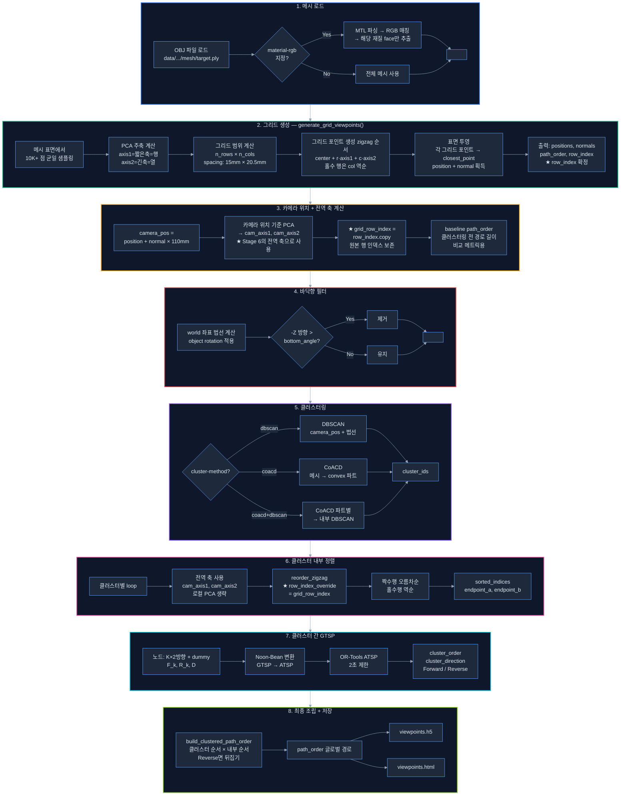

# Viewpoint 생성 파이프라인

```mermaid
%%{init: {'theme': 'dark', 'themeVariables': { 'primaryColor': '#3b82f6', 'primaryTextColor': '#f0f0f0', 'primaryBorderColor': '#60a5fa', 'secondaryColor': '#10b981', 'tertiaryColor': '#6366f1', 'lineColor': '#94a3b8', 'textColor': '#e2e8f0', 'mainBkg': '#1e293b', 'nodeBorder': '#60a5fa', 'clusterBkg': '#0f172a', 'clusterBorder': '#475569', 'edgeLabelBackground': '#1e293b' }}}%%

flowchart TD
    subgraph Stage1["1. 메시 로드"]
        A1["OBJ 파일 로드<br>data/.../mesh/target.ply"] --> A2{"material-rgb<br>지정?"}
        A2 -- Yes --> A3["MTL 파싱 → RGB 매칭<br>→ 해당 재질 face만 추출"]
        A2 -- No --> A4["전체 메시 사용"]
        A3 --> A5[" "]
        A4 --> A5
    end

    subgraph Stage2["2. 그리드 생성 — generate_grid_viewpoints()"]
        B1["메시 표면에서<br>10K+ 점 균일 샘플링"] --> B2["PCA 주축 계산<br>axis1=짧은축=행<br>axis2=긴축=열"]
        B2 --> B3["그리드 범위 계산<br>n_rows × n_cols<br>spacing: 15mm × 20.5mm"]
        B3 --> B4["그리드 포인트 생성 zigzag 순서<br>center + r·axis1 + c·axis2<br>홀수 행은 col 역순"]
        B4 --> B5["표면 투영<br>각 그리드 포인트 → closest_point<br>position + normal 획득"]
        B5 --> B6["출력: positions, normals<br>path_order, row_index<br>★ row_index 확정"]
    end

    subgraph Stage3["3. 카메라 위치 + 전역 축 계산"]
        C1["camera_pos =<br>position + normal × 110mm"] --> C2["카메라 위치 기준 PCA<br>→ cam_axis1, cam_axis2<br>★ Stage 6의 전역 축으로 사용"]
        C2 --> C3["★ grid_row_index =<br>row_index.copy<br>원본 행 인덱스 보존"]
        C3 --> C4["baseline path_order<br>클러스터링 전 경로 길이<br>비교 메트릭용"]
    end

    subgraph Stage4["4. 바닥향 필터"]
        D1["world 좌표 법선 계산<br>object rotation 적용"] --> D2{"-Z 방향 ><br>bottom_angle?"}
        D2 -- Yes --> D3["제거"]
        D2 -- No --> D4["유지"]
        D3 --> D5[" "]
        D4 --> D5
    end

    subgraph Stage5["5. 클러스터링"]
        E1{"cluster-method?"}
        E1 -- dbscan --> E2["DBSCAN<br>camera_pos + 법선"]
        E1 -- coacd --> E3["CoACD<br>메시 → convex 파트"]
        E1 -- coacd+dbscan --> E4["CoACD 파트별<br>→ 내부 DBSCAN"]
        E2 --> E5["cluster_ids"]
        E3 --> E5
        E4 --> E5
    end

    subgraph Stage6["6. 클러스터 내부 정렬"]
        F1["클러스터별 loop"] --> F2["전역 축 사용<br>cam_axis1, cam_axis2<br>로컬 PCA 생략"]
        F2 --> F3["reorder_zigzag<br>★ row_index_override<br>= grid_row_index"]
        F3 --> F4["짝수행 오름차순<br>홀수행 역순"]
        F4 --> F5["sorted_indices<br>endpoint_a, endpoint_b"]
    end

    subgraph Stage7["7. 클러스터 간 GTSP"]
        G1["노드: K×2방향 + dummy<br>F_k, R_k, D"] --> G2["Noon-Bean 변환<br>GTSP → ATSP"]
        G2 --> G3["OR-Tools ATSP<br>2초 제한"]
        G3 --> G4["cluster_order<br>cluster_direction<br>Forward / Reverse"]
    end

    subgraph Stage8["8. 최종 조립 + 저장"]
        H1["build_clustered_path_order<br>클러스터 순서 × 내부 순서<br>Reverse면 뒤집기"] --> H2["path_order 글로벌 경로"]
        H2 --> H3["viewpoints.h5"]
        H2 --> H4["viewpoints.html"]
    end

    Stage1 --> Stage2
    Stage2 --> Stage3
    Stage3 --> Stage4
    Stage4 --> Stage5
    Stage5 --> Stage6
    Stage6 --> Stage7
    Stage7 --> Stage8

    style Stage1 fill:#0f172a,stroke:#3b82f6,stroke-width:2px,color:#e2e8f0
    style Stage2 fill:#0f172a,stroke:#10b981,stroke-width:2px,color:#e2e8f0
    style Stage3 fill:#0f172a,stroke:#f59e0b,stroke-width:2px,color:#e2e8f0
    style Stage4 fill:#0f172a,stroke:#ef4444,stroke-width:2px,color:#e2e8f0
    style Stage5 fill:#0f172a,stroke:#8b5cf6,stroke-width:2px,color:#e2e8f0
    style Stage6 fill:#0f172a,stroke:#ec4899,stroke-width:2px,color:#e2e8f0
    style Stage7 fill:#0f172a,stroke:#06b6d4,stroke-width:2px,color:#e2e8f0
    style Stage8 fill:#0f172a,stroke:#84cc16,stroke-width:2px,color:#e2e8f0
```
